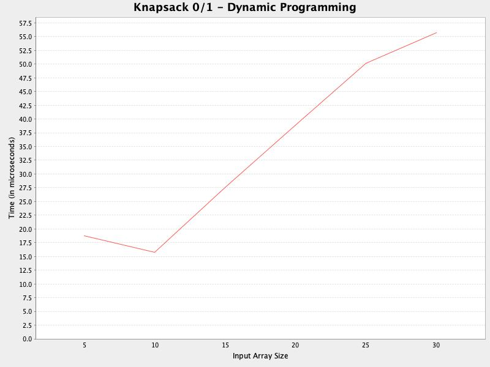

# Project 2 Final Report: Comparing Knapsacks Experiment

## Design description
<strong>Angela Fujihara</strong>, <em>Project Manager</em> 
Contributions:
<ul></ul>

<strong>Cheryl Moser</strong>, <em>Version Control Manager</em> 
Contributions: 
<ul>
    <li>Repository management
    <li>csv output
    <li>generation of 3 additional csv 
    files
    <li>K01 greedy algorithm & associated Junit tests
    <li>plot generation via JFreeChart.
</ul>

<strong>Mycole Brown</strong>, <em>Development Manager</em> 
Contributions:

<strong>Ashtin Rivada</strong>, <em>Design Manager</em> 
Contributions:

## Project Description
Design choices. Include brief description of design choices specific to our project. 
Discuss reason, thought process behind specific design choices. Discuss reasoning 
for how code was organized.

## Plot Charts and Performance Analysis:

<ul>
    <li>Fractional Dynamic VS 01 Dynamic
    <li>Fractional Dynamic VS Fractional Greedy
    <li>Fractional Dynamic VS 01Greedy
    <li>Fractional Dynamic VS Fractional Brute
    <li>Fractional Dynamic VS 01 Brute
    <li>Fractional Greedy VS Fractional Brute
    <li>Fractional Greedy VS 01 Brute
    <li>Fractional Greedy VS 01 Greedy
    <li>Fractional Brute VS 01 Greedy
    <li>Fractional Brute VS 01 Brute
    <li>Fractional Brute VS 01 Dynamic
    <li>01 Dynamic VS 01 Greedy
    <li>01 Dynamic VS Fractional Greedy
    <li>01 Dynamic VS 01 Brute
    <li>01 Greedy VS 01 Brute
</ul>

Discuss theoretical results vs empirical results 
Did our findings meet our theoretical expectations? 
Which algorithm performed best for which knapsack? 
01 Knapsack best algorithm: Why was this the best performing algorithm? 
Fractional Knapsack best algorithm: Why was this the best performing algorithm? 

Discuss the process for developing each algorithm. What types of methodologies were used?

Angela

### Greedy method for the knapsack 0-1 problem (Cheryl):
#### Description:
&nbsp;&nbsp;&nbsp;&nbsp;This method is a modified version of the greedy method for the fractional knapsack. 
It is not guaranteed to return optimal results, especially with larger input arrays. 
The Junit tests associated with this method confirm that with an input array of size 30, 
it does not report the optimal solution; however, with an array of size 5, it did. 
In designing the tests, an online calculator (https://augustineaykara.github.io/Knapsack-Calculator/) 
was used to find the actual optimized profit and weight for the test input. The 
greedy method for this problem is not optimal because it does not consider 
combinations of items; instead, it puts items into the knapsack sequentially by 
highest value until the weight limit is met.

#### Methods:
&nbsp;&nbsp;&nbsp;&nbsp;A priority queue was used in combination with a custom comparator for holding 
value-weight pairs in decreasing order by value. A hash set was used to store 
the items that were added to the knapsack. The method iterates through the priority 
queue, removing the highest value entry first and adding it to the knapsack until 
the queue is empty, or until the weight limit is met.

#### Analysis:
&nbsp;&nbsp;&nbsp;&nbsp;The time complexity of this method is O(n log n). This is due to the dequeue 
operation nested within the priority queue iterator operation. The iterator operation 
depends on the length of the priority queue, or the weight limit, either of which 
can be of any size; the dequeue operation involves a re-ordering of the queue, 
which is O(log n) due to the halving operations done on the binary heap.

Ashtin

Mycole

Were there any other algorithms that could have solved these problems? Such as divide-and-conquer?

## Purpose: 
To practice and demonstrate proficiency in creating brute force, greedy 
and dynamic programming algorithms for the fractional knapsack problem and the 01 
Knapsack problem.

## Skills Used: Java programming
Knowledge Goals: Greedy, Dynamic Programming and their applications.
See <a href = "./PROJECTSPEC.md">PROJECTSPEC.md</a> for more info regarding
this project's specifications.

## How to run this application
This application uses external libraries that must be added to the project's 
dependency list. Download the JFreeChart library 
<a href = "https://www.jfree.org/jfreechart/download/">here</a>, and download the 
guava-31.0.1-jre.jar file <a href = "https://repo1.maven.org/maven2/com/google/guava/guava/31.0.1-jre/">here</a>. 
Add the jar files to the project structure.

There are two knapsack packages, each with its own Main.java file. Run both of 
those to see their respective console output.
