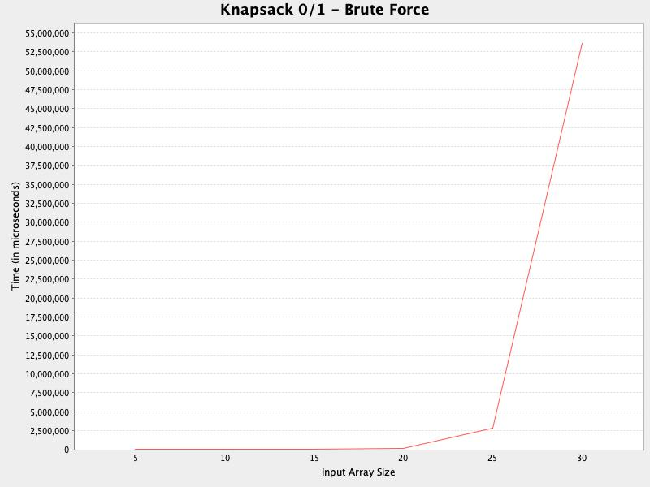

# Project 2 Final Report: Comparing Knapsacks Experiment

## Authors and Contributions
<dl>
<dt>Angela Fujihara, Project Manager</dt>
<dd>Contributions:
    <ul>
        <li>Project planning, weekly meeting facilitato
        <li>FracK brute force algorith
        <li>FracK greedy algorith
        <li>Final report outlin
        <li>Co-authored the CSV reader clas
    </ul>
</dd>

<dt>Cheryl Moser, Version Control Manager</dt>
<dd>Contributions:
    <ul>
        <li>Repository managemen
        <li>csv outpu
        <li>generation of 3 additional csv file
        <li>K01 greedy algorith
        <li>JUnit tests for K01 greed
        <li>Plot generation via JFreeChar
        <li>Translate final report to markdown fil
    </ul>
</dd>

<dt>Mycole Brown, Development Manager</dt>
<dd>Contributions:
    <ul>
        <li>Co-authored the CSV reader clas
        <li>K01 dynamic programming algorith
        <li>FracK dynamic programming algorith
    </ul>
</dd>

<dt>Ashtin Rivada, Design Manager</dt>
<dd>Contributions:
    <ul>
        <li>Project design & UML diagra
        <li>Knapsack object clas
        <li>K01 brute force algorith
        <li>JUnit tests for K01 brute forc
        <li>Co-authored CSV reader clas
        <li>Design review of deliverable
    </ul>
</dd>
</dl>

## Project Description
<cite>Author: Ashtin Rivada</cite>

For the structure we chose to use the template you provided for us in the project 
as each one of us would have our own classes that the others shouldn’t be making 
any edits on, so this would help us avoid merge conflicts where we could. We also 
came to an agreement that having the knapsack saved as an object would be the best 
approach, as we could input our data and manipulate it to fit each of our methods 
parameters. We added a ProjectTools package that holds any other classes, that 
aren't the knapsack classes themselves, to use in our project. As for graphing, 
unlike the last project, we decided to try and make the graphs in java ourselves 
so we wouldn't need to use anything other than intelliJ to complete the project.  

As for the metric we chose to use runtime again. We made this choice because it 
was an easy implementation since we used it for our last project, and also because 
the runtime of the algorithm is easy to understand, explain, and can directly show 
how efficient each algorithm is.  As for how our results will be displayed we have 
each of our methods printing out what weights and values were used, what knapsack 
number it is, the weight capacity, the total weight that we used, and the maximum 
profit onto the console while it is running. Then we have our class PlotGenerator 
that will display the runtimes as a graph, to do this we used a Java library called 
JFreeChart.

## Plot Charts
<cite>Author: Cheryl Moser</cite>

## Performance Analysis

<dl>
    <dt>Fractional Dynamic VS 01 Dynamic, <cite>Author: Mycole Brown</cite></dt>
</dl>

<dl>
    <dt>Fractional Dynamic VS Fractional Greedy, <cite>Author: Mycole Brown</cite></dt>
</dl>

<dl>
    <dt>Fractional Dynamic VS 01Greedy, <cite>Author: Mycole Brown</cite></dt>
</dl>

<dl>
    <dt>Fractional Dynamic VS Fractional Brute, <cite>Author: Mycole Brown</cite></dt>
</dl>

<dl>
    <dt>Fractional Dynamic VS 01 Brute, <cite>Author: Angela Fujihara</cite></dt>
    
--------Brute Force 0/1 Knapsack--------
    <dt>How it Works:</dt>
    <dd>This method checks every possible combination of items, making 
    it very slow, especially with larger datasets.
    </dd>
    <b>Speed</b>
    <ul>
        <li>csv file with 5 items - Approximate between 60k-70k microsecond
        <li>csv file with 10 items - Approximately between 0-10k microsecond
        <li>csv file with 15 items - Approximately between 20k-30k microsecond
        <li>csv file with 20 items - Approximately between 170k-180k microsecond
        <li>csv file with 25 items is off the chart
        <li>csv file with 30 items is off the chart
    </ul>
    <dt>Time Complexity:</dt>
    <dd>
    The time complexity of Brute Force 0/1 Knapsack is exponential, 
    typically represented as O(2n), where 'n' is the number of items. 
    This means that as 'n' increases, the time taken to find the optimal solution 
    grows exponentially.
    </dd>
    <dt>Execution Time:</dt>
    <dd>
    With small sets of items (like 5 or 10), it's relatively fast, 
    taking anywhere from no time at all to about 10 milliseconds. But as the number 
    of items increases, it can get really slow. For sets of 15 to 20 items, it takes 
    between about 20,000 to 180,000 microseconds. And for sets of 25 or 30 items, 
    it gets so slow that we can't even measure it accurately.
    </dd>
    --------Fractional Dynamic Knapsack:--------
    <dt>How it Works:</dt>
    <dd>
    This method sorts items by value-to-weight ratios before picking them, 
    which makes it faster than brute force.
    </dd>
    <b>Speed</b>
    <ul>
        <li>csv file with 5 items - Approximate between 4500-4750k microsecond 
        <li>csv file with 10 items - Approximately between 250-500 microsecond
        <li>csv file with 15 items - Approximately between 250-500 microsecond
        <li>csv file with 20 items - Approximately between 500-750 microsecond
        <li>csv file with 25 items - Approximately between 500-750 microsecond
        <li>csv file with 30 items - Approximately between 500-750 microsecond
    </ul>
    <dt>Time Complexity:</dt>
    <dd>
    The time complexity of Fractional Dynamic Knapsack is O(n log n), 
    where 'n' is the number of items. This complexity arises from sorting the items 
    by their value-to-weight ratios before selecting them, which enhances efficiency 
    compared to the brute force approach.
    </dd>
    <dt>Execution Time:</dt>
    <dd>
    Unlike brute force, Fractional Dynamic Knapsack stays consistently 
    fast no matter how many items you have. For sets of 5 to 30 items, it takes 
    about 250 to 500 microseconds most of the time. This shows that it handles 
    larger sets of items without slowing down much.
    </dd>
    <dt>Conclusion:</dt>
    <dd>
    Comparing the two methods using the provided data and considering their time 
    complexities, Fractional Dynamic Knapsack remains the preferred choice. While 
    Brute Force 0/1 Knapsack struggles with larger datasets due to its exponential 
    time complexity, Fractional Dynamic Knapsack maintains a more consistent and 
    efficient performance, demonstrating its superiority in handling larger sets 
    of items.
    </dd>
</dl>

<dl>
    <dt>Fractional Greedy VS Fractional Brute, <cite>Author: Angela Fujihara</cite></dt>
     
    ----------Greedy Fractional Knapsack--------
    <dt>How it Works:</dt>
    <dd>Greedy Fractional Knapsack selects items based on their value-to-weight 
    ratio, choosing the most valuable items first until the knapsack is full.
    </dd>
    <b>Speed</b>
    <ul>
        <li>csv file with 5 items - Approximate between 1500-1600 microsecond
        <li>csv file with 10 items - Approximately between 0-100 microsecond
        <li>csv file with 15 items - Approximately between 0-100 microsecond
        <li>csv file with 20 items - Approximately between 0-100 microsecond
        <li>csv file with 25 items - Approximately between 0-100 microsecond
        <li>csv file with 30 items - Approximately between 0-100 microsecond
    </ul>
    <dt>Time Complexity:</dt>
    <dd>
    Greedy Fractional Knapsack has a time complexity of O(n log n), meaning it's 
    pretty efficient even for large datasets. This complexity arises from sorting the 
    items by their value-to-weight ratios before selecting them.
    </dd>
    
----------Brute Force Fractional Knapsack--------
    <dt>How it Works:</dt>
    <dd>
    Brute Force Fractional Knapsack considers all possible combinations 
    of items to find the best solution, which can take a long time.
    </dd>
    <b>Speed</b>
    <ul>
        <li>csv file with 5 items - Approximate between 0-5000 microsecond
        <li>csv file with 10 items - Approximately between 0-5000 microsecond
        <li>csv file with 15 items - Approximately between 25k-30k microsecond
        <li>csv file with 20 items - Approximately between 120k-125k microsecond 
        <li>csv file with 25 items - off the char  
        <li>csv file with 30 items - off the char
    </ul>
    <dt>Time Complexity:</dt>
    <dd>
    The time complexity of Brute Force Fractional Knapsack is exponential, typically 
    represented as O(2n), where 'n' is the number of items. This means 
    that as 'n' increases, the time taken to find the optimal solution grows exponentially.
    </dd>
    <dt>Conclusion:</dt>
    <dd>
    The Greedy Fractional Knapsack algorithm works better overall. It's fast and 
    consistent across different dataset sizes, whereas the Brute Force approach 
    slows down a lot as the dataset gets bigger. Additionally, Greedy Fractional 
    Knapsack's time complexity suggests it's efficient even for larger datasets, 
    making it a preferable choice in most cases.
    </dd>
</dl>

<dl>
    <dt>Fractional Greedy VS 01 Brute, <cite>Author: Angela Fujihara</cite></dt>

----------Brute Force 0/1 Knapsack--------
    <dt>How it Works:</dt>
    <dd>
    Brute Force 0/1 Knapsack checks every possible combination 
    of items, which can take a lot of time, especially with more items.
    </dd>
    <b>Speed</b>
    <ul>
        <li>csv file with 5 items - Approximate between 60k-70k microseconds
        <li>csv file with 10 items - Approximately between 0-10k microseconds
        <li>csv file with 15 items - Approximately between 20k-30k microseconds
        <li>csv file with 20 items - Approximately between 170k-180k microseconds
        <li>csv file with 25 items is off the chart.
        <li>csv file with 30 items is off the chart.
    </ul>
    <dt>Time Complexity:</dt>
    <dd>
    The time complexity of Brute Force 0/1 Knapsack is exponential, 
    typically represented as O(2n), where 'n' is the number of items. This means 
    that as 'n' increases, the time taken to find the optimal solution grows exponentially.
    </dd>
    ----------Greedy Fractional Knapsack:--------
    <dt>How it Works:</dt>
    <dd>
    Greedy Fractional Knapsack picks items with the best value-
    to-weight ratio first until the knapsack is full.
    </dd>
    <b>Speed</b>
    <ul>
        <li>csv file with 5 items - Approximate between 1500-1600 microseconds
        <li>csv file with 10 items - Approximately between 0-100 microseconds
        <li>csv file with 15 items - Approximately between 0-100 microseconds
        <li>csv file with 20 items - Approximately between 0-100 microseconds  
        <li>csv file with 25 items - Approximately between 0-100 microseconds  
        <li>csv file with 30 items - Approximately between 0-100 
    </ul>
    <dt>Time Complexity:</dt>
    <dd>
    Greedy Fractional Knapsack has a time complexity of O(n log n), 
    making it efficient even for larger datasets. This complexity arises from sorting 
    the items by their value-to-weight ratios before selecting them.
    </dd>
    <dt>Conclusion:</dt>
    <dd>
    Based on the data and considering how long they take, Greedy 
    Fractional Knapsack is faster. It stays speedy across different dataset sizes, 
    while Brute Force 0/1 Knapsack slows down a lot as the dataset gets bigger. 
    Greedy Fractional Knapsack seems like a better choice when you need a quick 
    and decent solution. But keep in mind, the Greedy approach isn't always perfect.
    Sometimes it might not give the best answer, especially if the problem is more 
    complicated. So, while Greedy Fractional Knapsack is fast and handy, it might 
    not always give you the absolute best solution.
    </dd>
</dl>

<dl>
    <dt>Fractional Greedy VS 01 Greedy, <cite>Author: Angela Fujihara</cite></dt>
        
----------Greedy Fractional Knapsack--------
        <dt>How it Works:</dt>
        <dd>
        Greedy Fractional Knapsack selects items based on their 
        value-to-weight ratio, prioritizing those with the best ratio until the knapsack is full.
        </dd>
        <b>Speed</b>
        <ul>
            <li>For 5 items: Around 1500-1600 microseconds.
            <li>For 10 items: Roughly 0-100 microseconds.
            <li>For 15 items: Also approximately 0-100 microseconds.
            <li>For 20 items: Similarly, around 0-100 microseconds.
            <li>For 25 items: Consistently about 0-100 microseconds.
            <li>For 30 items: Maintaining around 0-100 microseconds.
        </ul>
        <dt>Time Complexity:</dt>
        <dd>
        Greedy Fractional Knapsack has a time complexity of O(n log n), 
        ensuring efficiency even with larger datasets. It sorts items by their value-to-weight 
        ratios before selection.
        </dd>
        ----------Greedy 0/1 Knapsack--------
        <dt>How it Works:</dt>
        <dd>
        Greedy 0/1 Knapsack prioritizes the most valuable items first, 
        assessing whether each fits entirely into the knapsack.
        </dd>
        <b>Speed</b>
        <ul>
            <li>For 5 items: Approximately 16,000-17,000 microseconds.
            <li>For 10 items: Typically between 0-1000 microseconds.
            <li>For 15 items: Similarly, around 0-1000 microseconds.
            <li>For 20 items: Also about 0-1000 microseconds.
            <li>For 25 items: Usually between 1000-2000 microseconds.
            <li>For 30 items: Consistently between 1000-2000 microseconds.
        </ul>
        <dt>Time Complexity:</dt>
        <dd>
        Greedy 0/1 Knapsack's time complexity depends on implementation 
        but generally handles larger datasets reasonably well. While it doesn't sort 
        items like the Fractional Knapsack, it maintains efficiency without significant slowdowns.
        </dd>
        <dt>Conclusion:</dt>
        <dd>
        Considering the execution times and time complexities, both Greedy Fractional 
        Knapsack and Greedy 0/1 Knapsack perform well, particularly with smaller datasets. 
        Greedy Fractional Knapsack exhibits consistent speed across all dataset sizes, 
        while Greedy 0/1 Knapsack slightly increases in time with larger datasets. 
        Overall, Greedy Fractional Knapsack appears to handle larger datasets more efficiently, 
        making it preferable in many cases.
        </dd>
</dl>

<dl>
    <dt>Comparison Note for Brute Force</dt>
    <dd>
    The runtimes for both brute force methods up to knapsack #4 are A LOT less 
    than 5,000,000 Microseconds, but due to the exponentially high runtime of knapsack 
    #6 it is hard to say what the number actually is)
    </dd>

    <dt>01 dynamic vs 01 greedy, <cite>Author: Ashtin Rivada</cite></dt>
-

    <dt>Fractional Brute vs 01 Greedy, <cite>Author: Ashtin Rivada</cite></dt>
    <dd>
    <ul>
    ----------01 Greedy Speeds----------
        <li>Knapsack #1: 9,500 Microseconds
        <li>Knapsack #2: about 650 Microseconds 
        <li>Knapsack #3: about 800 Microseconds
        <li>Knapsack #4: about 1,100 Microseconds
        <li>Knapsack #5: about 1,250 Microseconds
        <li>Knapsack #6: about 1,400 Microseconds
    </ul>
    <ul>
    ----------Fractional Brute Speeds----------
        <li>Knapsack #1: Less than 5,000,000 Microseconds 
        <li>Knapsack #2:  Less than 5,000,000 Microseconds
        <li>Knapsack #3:  Less than 5,000,000 Microseconds
        <li>Knapsack #4:  Less than 5,000,000 Microseconds
        <li>Knapsack #5:  about 5,000,000 Microseconds
        <li>Knapsack #6: about 130,000,000 Microseconds 
    </ul>
    </dd>
    <dt>Comparison</dt>
    <dd>
    We can see there is a clear winner in which method ran faster. That would be 
    the Greedy for the 01 Knapsack. It is very fast and does not change the runtime 
    much, even for the bigger datasets that Brute force takes forever to finish. 
    I am assuming the first knapsack for 01 Greedy took much longer than the rest 
    probably due to all the initializations going through for the first call but 
    those would not have to be made for the following tests as they were made in 
    the first and would just need to be updated.
    </dd>
</dl>

<dl>
    <dt>Fractional Brute vs 01 Brute, <cite>Author: Ashtin Rivada</cite></dt>
    <dd> 
    ----------01 Brute Speeds----------
    <ul>
        <li>Knapsack #1:  Less than 2,500,000 Microseconds 
        <li>Knapsack #2:  Less than 2,500,000 Microseconds
        <li>Knapsack #3:  Less than 2,500,000 Microseconds
        <li>Knapsack #4:  Less than 2,500,000 Microseconds
        <li>Knapsack #5: about 2,700,000 Microseconds
        <li>Knapsack #6: about 54,000,000 Microseconds
    </ul>
        ----------Fractional Brute Speeds----------
    <ul>
        <li>Knapsack #1: Less than 5,000,000 Microseconds
        <li>Knapsack #2:  Less than 5,000,000 Microseconds
        <li>Knapsack #3:  Less than 5,000,000 Microseconds
        <li>Knapsack #4:  Less than 5,000,000 Microseconds
        <li>Knapsack #5:  about 5,000,000 Microseconds
        <li>Knapsack #6: about 130,000,000 Microseconds 
    </ul>
    <dt>Comparison</dt>
    <dd>
    Both the Brute force method for the 01 Knapsack and for the Fractional Knapsack 
    look similar. Each method can solve up to size 20 pretty fast, remaining very 
    close to the x-axis. Then when we start on Knapsack #5 which has 25 items we 
    start to see a slight increase for both methods for their runtime. With the 
    01 knapsack reaching about 2,700,000 microseconds and the fractional reaching 
    about 5,000,000. Finally we get to knapsack #6 which has 30 items so the number 
    of combinations increases exponentially. We have the 01 knapsack running at 
    about 54,000,000 and fractional running at about 130,000,000. We can see here 
    that once the brute force reaches a certain point it takes a very long time 
    to finish. The 01 brute force ran about 2x as fast as the fractional probably 
    due to not having to ratio any items to make sure all of the maximum weight 
    was taken up.  With this being said The brute force approach would not be ideal 
    for larger dataSets as the runtime would increase exponentially.
    </dd>
</dl>

<dl>
    <dt>Fractional Brute vs 01 Dynamic, <cite>Author: Ashtin Rivada</cite></dt>
    -
</dl>

<dl>
    <dt>01 Dynamic VS Fractional Greedy, <cite>Author: Cheryl Moser</cite></dt>
    -
</dl>

<dl>
    <dt>01 Dynamic VS 01 Brute, <cite>Author: Cheryl Moser</cite></dt>
    -
</dl>

<dl>
<dt>01 Greedy VS 01 Brute, <cite>Author: Cheryl Moser</cite></dt>
     
    <dd>
    It seems that all the algorithm plots begin with an outlier point. I suspect 
    this is due to a slowdown caused by the initialization that happens as the code 
    enters a new algorithm class. I confirmed that the array size of 5 is not the issue 
    by placing the array of size 30 into the first plot point generation, and the array 
    of size 5 into the last. The graph still showed that first outlier point. I
    conducted this test for the K01 Greedy algorithm only.
     
    Discarding the first plot point, greedy performed better across the board in this 
    comparison, holding steady around 300ms for all array sizes except size = 25. 
    This point spiked slightly to just above 500ms in the test iteration that I analyzed. 
    The greedy plot appears to be a curve resembling an O(log n) curve; the brute force 
    plot shows an exponential curve.
    </dd>
</dl>

## Theoretical results vs empirical results
<cite>Author: Mycole Brown</cite>

## Which algorithm performed best for which knapsack?
<dl><cite>Author: Angela Fujihara</cite>
    <dt>0/1 Knapsack:</dt>
        <dd>    
        Why Greedy is Best: The Greedy approach is effective for the 0/1 Knapsack 
        problem because it prioritizes immediate gains. It quickly selects items with the 
        highest value-to-weight ratio, filling the knapsack until capacity is reached. 
        Although it may not always find the optimal solution, it generally provides a good 
        approximation efficiently. In contrast, the brute-force method exhaustively evaluates 
        all combinations, becoming prohibitively slow as the dataset size increases.
        </dd>
    <dt>For Fractional Knapsack:</dt>
        <dd>    
            Why Dynamic Programming and Greedy are Best:
            <ul>
                <li>Dynamic Programming (Fractional Knapsack): 
                This approach excels, particularly for larger tasks. It breaks down the 
                problem into smaller, manageable parts and efficiently combines their solutions 
                without sacrificing efficiency.
 
                <li>Greedy (Fractional Knapsack): Greedy remains a viable choice, especially 
                for smaller datasets. It prioritizes items with the best value-to-weight 
                ratio, adding them to the knapsack incrementally. While it may not always 
                yield the optimal solution, its speed and reliability make it a practical 
                option for smaller-scale problems.
            </ul>
        </dd>
    <dt>Conclusion:</dt>
        <dd>
        In conclusion, Dynamic Programming and Greedy algorithms stand out as the top 
        contenders for Fractional Knapsack problems. Dynamic Programming's systematic 
        approach to problem-solving and efficient solution recombination make it ideal 
        for larger datasets. On the other hand, Greedy offers speed and reliability, 
        making it a suitable choice for smaller-scale tasks. For 0/1 Knapsack problems, 
        Greedy strikes a balance between efficiency and accuracy, making it the preferred 
        method over the brute-force approach.
        </dd>
</dl>

## Algorithm development

### [algorithm 1 title]
<cite>Author: Angela Fujihara</cite>
<dl>
<dt></dt>
<dd></dd>

### [algorithm 2 title]
<cite>Author: Angela Fujihara</cite>
<dt></dt>
<dd></dd>
</dl>

### Greedy method for the knapsack 0-1 problem
<cite>Author: Cheryl Moser</cite>
<dl>
<dt>Description</dt>
    <dd>
    This method is a modified version of the greedy method for the fractional knapsack. 
    It is not guaranteed to return optimal results, especially with larger input arrays. 
    The Junit tests associated with this method confirm that with an input array of size 30, 
    it does not report the optimal solution; however, with an array of size 5, it did. 
    In designing the tests, an online calculator (https://augustineaykara.github.io/Knapsack-Calculator/) 
    was used to find the actual optimized profit and weight for the test input. The 
    greedy method for this problem is not optimal because it does not consider 
    combinations of items; instead, it puts items into the knapsack sequentially by 
    highest value until the weight limit is met.
    </dd>

<dt>Methods</dt>
    <dd>
    A priority queue was used in combination with a custom comparator for holding 
    value-weight pairs in decreasing order by value. A hash set was used to store 
    the items that were added to the knapsack. The method iterates through the priority 
    queue, removing the highest value entry first and adding it to the knapsack until 
    the queue is empty, or until the weight limit is met.
    </dd>

<dt>Analysis</dt>
<dd>
    The time complexity of this method is O(n log n). This is due to the dequeue 
    operation nested within the priority queue iterator operation. The iterator operation 
    depends on the length of the priority queue, or the weight limit, either of which 
    can be of any size; the dequeue operation involves a re-ordering of the queue, 
    which is O(log n) due to the halving operations done on the binary heap.
</dd>
</dl>

### 01 Brute Force
<cite>Author: Ashtin Rivada</cite>
<dl>
<dt></dt>
<dd>
    My process for developing my algorithm came after a bunch of research. My first 
    approach was using recursion to get all possibilities of combinations but this 
    seemed to have optimized my method, as I ran it and it solved all the tests 
    too fast to be considered a true brute force method. This made me take some 
    time and try to come up with a way to get all combinations without using any 
    recursion. I concluded that making each weight and value pair an item of itself 
    would make it easier for comparison and combinations.Then after some time 
    researching I found a Java library that could get these combinations for me 
    without optimizing my brute force. To make this work I needed a Set of Items 
    rather than the array of Items I was originally using so I converted this to 
    the set and was able to use a method from a java library called “Sets.powerSet”. 
    This gave me all the possible combinations and from the inputted set of items, 
    then I looked through each combination making sure the total weight the combination 
    had was under the maximum weight allowed and if this was true I checked if the 
    total profit was greater than what I currently had and if it was, it was now 
    our new total profit. After they are all checked the one with the greatest 
    profit while also staying within the allowed weight range was saved as my best 
    choice and I was able to use that to print my answers into the console.
</dd>
</dl>

### [algorithm 1 title]
<cite>Author: Mycole Brown</cite>
<dl>
<dt></dt>
<dd></dd>

### [algorithm 2 title]
<cite>Author: Mycole Brown</cite>
<dt></dt>
<dd></dd>
</dl>

## Were there any other algorithms that could have solved these problems? Such as divide-and-conquer?
<cite>Author: Mycole Brown</cite>

## How to run this application
This application uses external libraries that must be added to the project's 
dependency list. Download the JFreeChart library 
<a href = "https://www.jfree.org/jfreechart/download/">here</a>, and download the 
guava-31.0.1-jre.jar file <a href = "https://repo1.maven.org/maven2/com/google/guava/guava/31.0.1-jre/">here</a>. 
Add the jar files to the project structure.

There are two knapsack packages, each with its own Main.java file. Run both of 
those to see their respective console output.
